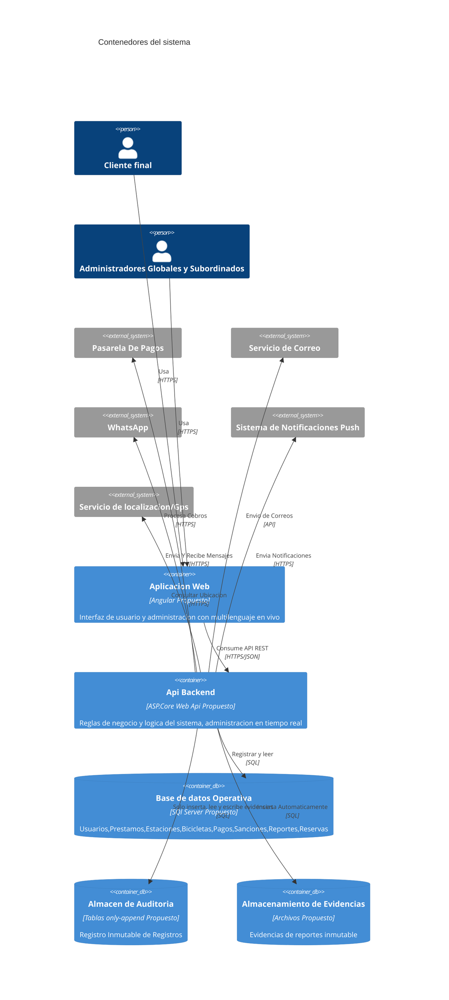

## **Nivel 2: Contenedores del sistema

```mermaid
C4Context

title Contenedores del sistema 

Person(usuario, "Cliente final")
Person(admin, "Administradores Globales y Subordinados")


System_Ext(psp, "Pasarela De Pagos")
System_Ext(correo, "Servicio de Correo")
System_Ext(wa, "WhatsApp")
System_Ext(noti, "Sistema de Notificaciones Push")
System_Ext(gps, "Servicio de localizacion/Gps")


Container(app, "Aplicacion Web","Angular Propuesto", "Interfaz de usuario y administracion con multilenguaje en vivo")
Container(api, "Api Backend","ASP.Core Web Api Propuesto","Reglas de negocio y logica del sistema, administracion en tiempo real")


ContainerDb(db, "Base de datos Operativa", "SQl Server Propuesto", "Usuarios,Prestamos,Estaciones,Bicicletas,Pagos,Sanciones,Reportes,Reservas")
ContainerDb(auditoria, "Almacen de Auditoria", "Tablas only-append Propuesto","Registro Inmutable de Registros")
ContainerDb(eviden, "Almacenamiento de Evidencias", "Archivos Propuesto", "Evidencias de reportes inmutable")


Rel(usuario, app, "Usa", "HTTPS")
Rel(admin, app, "Usa", "HTTPS")
Rel(api,wa, "Envia Y Recibe Mensajes", "HTTPS")
Rel(api,noti, "Envia Notificaciones", "HTTPS")
Rel(api,gps, "Consultar Ubicacion", "HTTPS")
Rel(api,correo, "Envio de Correos", "API")
Rel(api,psp, "Procesa Cobros", "HTTPS")
Rel(app,api, "Consume API REST", "HTTPS/JSON")
Rel(api,db, "Registrar y leer", "SQL")
Rel(api,auditoria, "Solo inserta, lee y escribe evidencias", "SQL")
Rel(api,eviden, "Inserta Automaticamente", "SQL")


```