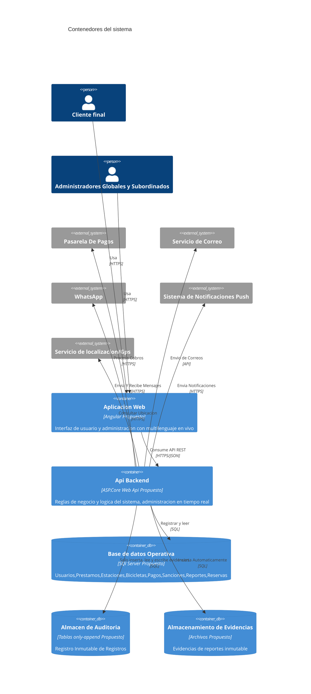

## **Nivel 2: Contenedores del sistema

| Contenedor | Tecnología (propuesta) | Responsabilidad | Impulsores |
|---|---|---|---|
| Aplicación Web (SPA) | Angular | Vistas de cliente y de administración, cambio de idioma, contador de tiempo restante sin recargar, ocultar funciones no autorizadas | RNF-13, RNF-20, RNF-23, HU-21 |
| API Backend | ASP.NET Core Web API en capas | Casos de uso, reglas de negocio, RBAC, canal en tiempo real, integración con pasarela, GPS y notificaciones, logs, y tareas programadas (préstamos vencidos y sanciones, avisos de tiempo restante, saturación de estaciones) | RNF-01 a RNF-03, RNF-08, RNF-11, RNF-12, RNF-16 a RNF-18, RN-06, RN-028 |
| Base de datos operativa | SQL Server | Datos del negocio: usuarios, estaciones, bicicletas, reservas, préstamos, pagos, sanciones y reportes. El backup periódico se configura en el motor | RNF-05 a RNF-07, HU-19 |
| Almacén de auditoría | Tablas append-only (esquema o base separada, solo INSERT) | Registro inmutable de cambios, sanciones, permisos y accesos a datos personales | RN-09, RNF-09, RNF-21, RNF-22 |
| Almacenamiento de evidencias | Archivos / Blob | Evidencias adjuntas a reportes; una vez subidas no se modifican | RN-022 |