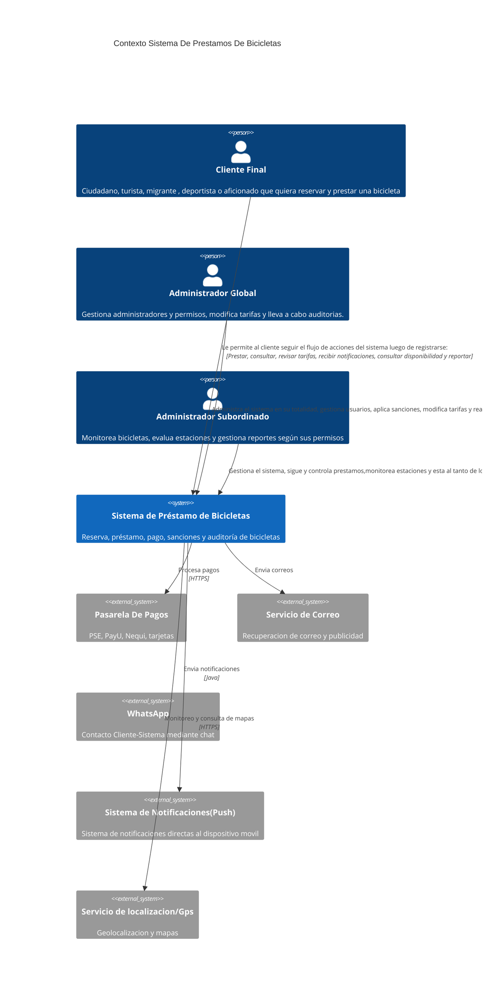

## ** Nivel 1: Contexto del sistema**

| Elemento | Tipo | Responsabilidad | Requisitos de Usuario|RF y HU | RNF Y RN |
|---|---|---|---|---|---|
|Cliente final | Persona | Ciudadano, turista, migrante , deportista o aficionado que quiera reservar y prestar una bicicleta | RU-01 a RU-13, RU-17, RU-28, RU-30|RF-01 a RF-11; HU-01 a HU-11, HU-18, HU-21|RN-01 a RN-08, RN-014 a RN-017, RN-021, RN-027, RN-029, RN-030; RNF-10, RNF-13, RNF-23 |
|Administrador global|Persona |Gestiona administradores, permisos y tarifas|RU-20, RU-21, RU-22, RU-29 |RF-16, RF-17; HU-16|RN-011, RN-023 a RN-025; RNF-20, RNF-21|
|Administrador Subordinado |Persona |Monitoreo de  bicicletas, estaciones y reportes según sus permisos |RU-14 a RU-16, RU-18, RU-19, RU-23 a RU-27, RU-31|RF-11 a RF-15, RF-18 a RF-21; HU-11 a HU-15, HU-17, HU-19|RN-09, RN-012, RN-013, RN-018 a RN-020, RN-022, RN-026, RN-028; RNF-09, RNF-22 |
|Pasarela de pagos | Sistema Externo | Procesa el pago despues de cada prestamo |RU-13| HU-18 |RN-02, RN-016, RN-030; RNF-08, RNF-17 | 
| Correco |  Sistema Externo | Envia un enlance para la recuperacion de la cuenta y demas informacion pertinente |RU-17 |RF-02; HU-01, HU-02 |RNF-12 |  
| WhatssApp |  Sistema Externo | Permite la comunicacion directa del cliente con el sistema | | |RNF-11, RNF-12 | 
| Sistema de Notificaciones |  Sistema Externo |  Envia notificaciones tipo PUSH al cliente sobre el estado de su prestamo, cual es su tiempo restante y demas novedades |RU-05 |RF-06; HU-06 |RN-04; RNF-12 |  
|Servicio GPS |  Sistema Externo |  Ubicacion de bicicletas y estaciones |  |  |RNF-02, RNF-16  |  

