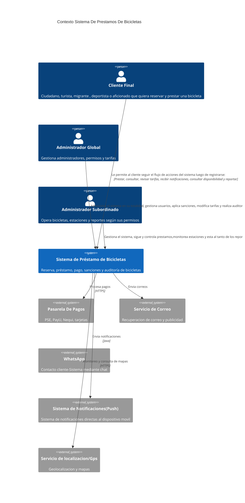

## ** Nivel 1: Contexto del sistema**

```mermaid
C4Context

title Contexto Sistema De Prestamos De Bicicletas

Person(usuario, "Cliente Final","Ciudadano, turista, migrante , deportista o aficionado que quiera reservar y prestar una bicicleta")
Person(adming, "Administrador Global", "Gestiona administradores, permisos y tarifas")
Person(admins, "Administrador Subordinado", "Opera bicicletas, estaciones y reportes según sus permisos")


System(spb, "Sistema de Préstamo de Bicicletas", "Reserva, préstamo, pago, sanciones y auditoría de bicicletas")


System_Ext(psp, "Pasarela De Pagos", "PSE, PayU, Nequi, tarjetas")
System_Ext(correo, "Servicio de Correo", "Recuperacion de correo y publicidad")
System_Ext(wa, "WhatsApp", "Contacto cliente-Sistema mediante chat")
System_Ext(noti, "Sistema de Notificaciones(Push)", "Sistema de notificaciones directas al dispositivo movil")


System_Ext(gps, "Servicio de localizacion/Gps", "Geolocalizacion y mapas")


Rel(usuario, spb, "Le permite al cliente seguir el flujo de acciones del sistema luego de registrarse:" "Prestar, consultar, revisar tarifas, recibir notificaciones, consultar disponibilidad y reportar")
Rel(admins, spb, "Gestiona el sistema, sigue y controla prestamos,monitorea estaciones y esta al tanto de los reportes")
Rel(adming, spb, "Administra el sistema en su totalidad, gestiona usuarios, aplica sanciones, modifica tarifas y realiza auditorias")

Rel(spb, psp, "Procesa pagos", "HTTPS")
Rel(spb, correo, "Envia correos"," "API")
Rel(spb, wa, "Envia y recibe mensajes", "HTTPS")
Rel(spb, noti, "Envia notificaciones", "Java")
Rel(spb, gps, "Monitoreo y consulta de mapas","HTTPS")
```

| Elemento | Tipo | Responsabilidad | Fuente |
|---|---|---|---|
|
